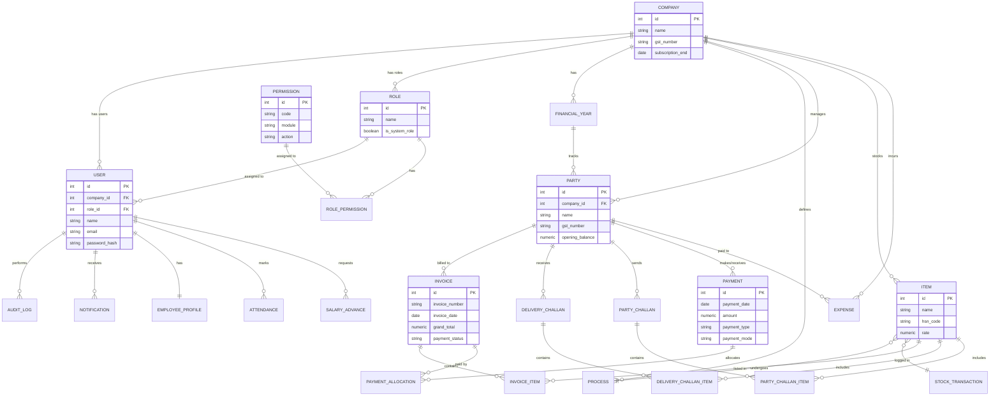

# Database Schema Design

This document outlines the full database schema for the Smart Bill Web App.

## Entity Relationship Diagram (ERD)

## Detailed Schema Description

### 1. Authentication & User Management

| Table                | Description                                                                                  | Key Columns                                             |
| :------------------- | :------------------------------------------------------------------------------------------- | :------------------------------------------------------ |
| **users**            | Stores system users (Super Admin, Company Admins, Employees).                                | `id`, `company_id`, `role_id`, `email`, `password_hash` |
| **roles**            | Defines user roles (e.g., 'Company Admin', 'Sales Manager'). System roles cannot be deleted. | `id`, `company_id`, `name`, `is_system_role`            |
| **permissions**      | Granular permissions for modules (e.g., `invoices.create`).                                  | `id`, `code`, `module`, `action`                        |
| **role_permissions** | Many-to-many link between Rolse and Permissions.                                             | `role_id`, `permission_id`                              |
| **audit_logs**       | Tracks important user actions for security and debugging.                                    | `user_id`, `action`, `details`, `ip_address`            |
| **notifications**    | System notifications for users.                                                              | `title`, `message`, `type`, `is_read`                   |

### 2. Core Business Structure

| Table              | Description                                                | Key Columns                                    |
| :----------------- | :--------------------------------------------------------- | :--------------------------------------------- |
| **company**        | The tenant/business entity. Includes subscription details. | `id`, `name`, `gst_number`, `subscription_end` |
| **financial_year** | Fiscal years for accounting boundaries.                    | `id`, `company_id`, `start_date`, `end_date`   |
| **processes**      | Manufacturing processes (e.g., 'Casting', 'Polishing').    | `id`, `company_id`, `name`                     |

### 3. CRM & Inventory

| Table                  | Description                                           | Key Columns                                     |
| :--------------------- | :---------------------------------------------------- | :---------------------------------------------- |
| **party**              | Customers and Vendors.                                | `id`, `company_id`, `name`, `gst_number`        |
| **items**              | Products/Services for sale or purchase.               | `id`, `name`, `hsn_code`, `rate`, `process_id`  |
| **stock_transactions** | Logs stock movements (IN/OUT) for inventory tracking. | `id`, `item_id`, `quantity`, `transaction_type` |

### 4. Sales & Invoicing

| Table                      | Description                                          | Key Columns                                                 |
| :------------------------- | :--------------------------------------------------- | :---------------------------------------------------------- |
| **invoice**                | Sales invoices generated for parties.                | `id`, `invoice_number`, `party_id`, `grand_total`, `status` |
| **invoice_items**          | Line items within an invoice.                        | `id`, `invoice_id`, `item_id`, `quantity`, `rate`, `amount` |
| **delivery_challan**       | Delivery notes for shipping goods.                   | `id`, `challan_number`, `party_id`, `status`                |
| **delivery_challan_items** | Items included in a delivery challan.                | `id`, `challan_id`, `item_id`, `quantity`                   |
| **party_challan**          | Challans received from parties (e.g., for job work). | `id`, `challan_number`, `party_id`, `status`                |
| **party_challan_items**    | Items inside a party challan.                        | `id`, `party_challan_id`, `item_id`, `quantity_ordered`     |

### 5. Financials

| Table                  | Description                             | Key Columns                                                         |
| :--------------------- | :-------------------------------------- | :------------------------------------------------------------------ |
| **payments**           | Payments made or received.              | `id`, `party_id`, `amount`, `payment_date`, `type` (PAID/RECEIVED)  |
| **payment_allocation** | Links payments to specific invoices.    | `payment_id`, `invoice_id`, `amount`                                |
| **expenses**           | Business expenses (e.g., Rent, Salary). | `id`, `category`, `amount`, `payment_method`, `party_id` (optional) |

### 6. HR & Payroll

| Table                 | Description                                   | Key Columns                                                          |
| :-------------------- | :-------------------------------------------- | :------------------------------------------------------------------- |
| **employee_profiles** | Extended profile for users who are employees. | `user_id`, `designation`, `base_salary`, `joining_date`, `documents` |
| **attendance**        | Daily attendance logs.                        | `user_id`, `date`, `status`, `overtime_hours`                        |
| **salary_advances**   | Tracks salary advances given to employees.    | `user_id`, `amount`, `date`, `is_deducted`                           |
